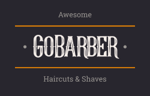

<h2 align="center">
  
   
  GoBarber - the best way to schedule your haircut!
</h1>

GoBarber is a Web and Mobile application for management and interaction between the barbershop providers and their custormers.

## 🚀 Technologies:
- Typescript
- Node.JS
- ReactJS
- React Native
- PostgreSQL
- MongoDB
- Redis
- Styled components
- And more...
